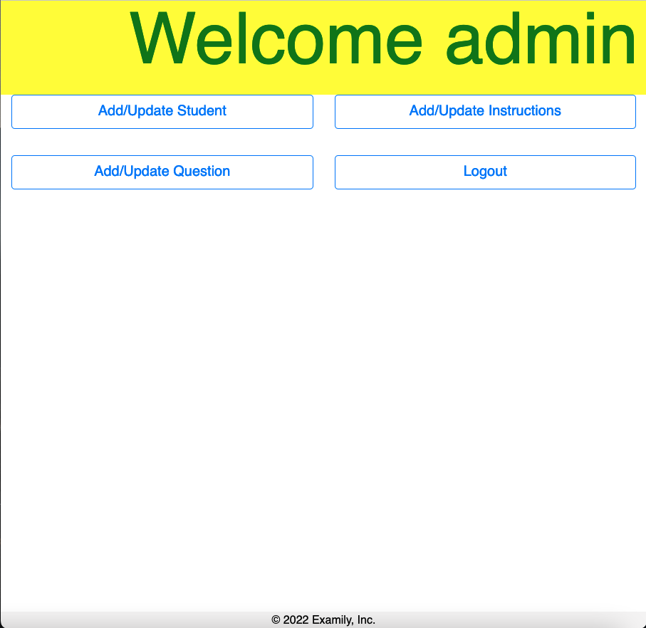
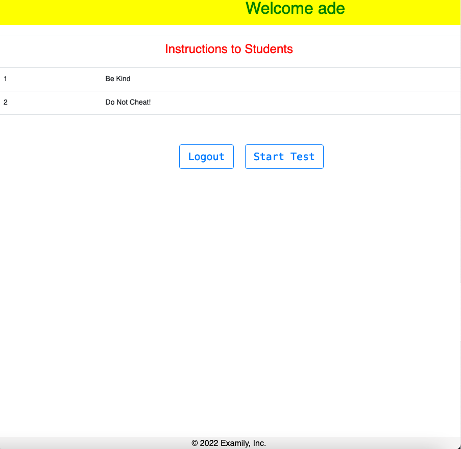

# Examily: An Online Quiz System 


## 1. Project Description:

Examily is a quiz-based examination platform for University level courses.

It allows access to two types of users, with the following functions:

- Examiner -> Log in, Register Students (User Name & Password), Set Exam Instructions, Set Exam Questions & Answers, Log Out.
    
- Student -> Log In, Take Exam, View Results, Log Out.


## 2. Tech Stack:

- HTML / CSS / JavaSript / Bootstrap

- Java 11 / Java EE version 8 (Jakarta EE version 8)

- Java JSP

- Java Servlet

- JDBC Driver

- MySQL DB / MySQL Server / MySQL Workbench

- Apache Tomcat Server

- Apache Netbeans IDE


## 3. Installing

Project Prerequisite: 
- Apache NetBeans 13.0, 
- Apache Tomcat Server 10.0, 
- MySQL Server, 
- MySQL Workbench (Optional ... I prefer to perform MySql operations at the command line "mysql -u root -p")
- Be mindful that you will need to add the following libraries to the project:

(a) mysql-connector-java-8.0.17.jar

(b) jsp-api.jar

(c) servlet-api.jar

- How to use:

1. Clone the repo.

```
https://github.com/AAdewunmi/Online-Quiz-System.git
```

2. Database

- Start MySQL Server

- Create tables in MySQL (SQL queries are in /web/db.txt)

3. IDE:

- Open project in NetBeans

- Start Apache Tomcat Server

- Run the application in the IDE (NetBeans)

- On "Evently" landing page:

        (i) Login as an Admin:
        
        Admin username -> admin
        
        Admin password -> admin
        
Enjoy 😎
        
## 4. Contributing:

Pull requests are welcome. For major changes, please open an issue first to discuss what you would like to change.

👇 👇 👇

Future plans:

1. Examily Landing Page: 
- Implement "Search Button" functionality 
- Implement "Recieve Our Newsletter!" Button functionality
2. Examiner Login Page:
- Implement Log In With Google Button functionality
- Implement Sign up link -> Create new account page (Landing page link!)
3. Student Login Page:
- Implement Log In With Google Button functionality


## 5. Screenshots

- Examily landing page:


- Examily examiner landing page:



- Examily stduent landing page:




## Adapted from:

UDEMY: Java Development Mega Course: Build Projects Practically

(Java Programming Course: Learn Development of JAVA Projects Using JSP, JDBC, Servlets, Swing, Spring Boot, Maven, Hibernate)

Project Name: Project 36: Online Quiz Sysem

Created by: Engineering.Org.In

Last updated: 03/2022

URL: https://www.udemy.com/course/build-real-world-java-projects-using-spring-jsp-jdbc/

