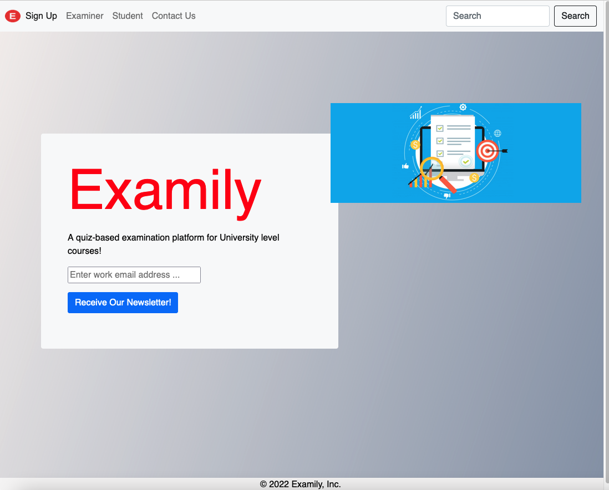

# Examily: An Online Quiz System (Work-In-Progress)

## What is the project? 

The aim of this project is to develop a quiz-based examination platform for University level courses.

### Screenshot of the landing page:

## Tech Stack:

1. HTML / CSS / JavaSript / Bootstrap

2. Java 11 / Java EE version 8 (Jakarta EE version 8)

3. Java JSP

4. Java Servlet

5. JDBC Driver

6. MySQL DB / MySQL Server / MySQL Workbench

7. Apache Tomcat Server

8. Apache Netbeans IDE

## What is the MVP?

1. Administration User: Create User Account, Login, Set Quiz, View Results, Log Out.

2. Student User: Login, Take Quiz, Log Out.

## What are the sprinkles (Nice to haves)? 

## When will the project be complete? 

The project will be complete once all the MVP features have been implemented.

## Adapted from:

UDEMY: Java Development Mega Course: Build Projects Practically

(Java Programming Course: Learn Development of JAVA Projects Using JSP, JDBC, Servlets, Swing, Spring Boot, Maven, Hibernate)

Project Name: Project 36: Online Quiz Sysem

Created by: Engineering.Org.In

Last updated: 03/2022

URL: https://www.udemy.com/course/build-real-world-java-projects-using-spring-jsp-jdbc/

